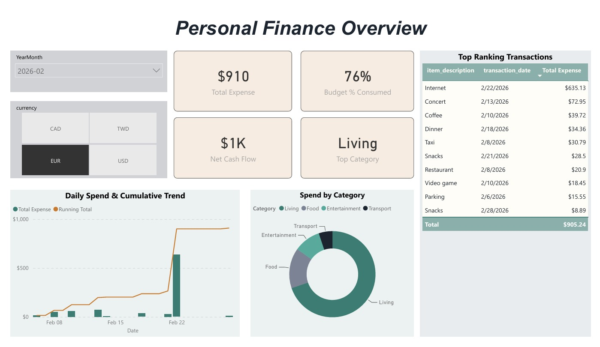
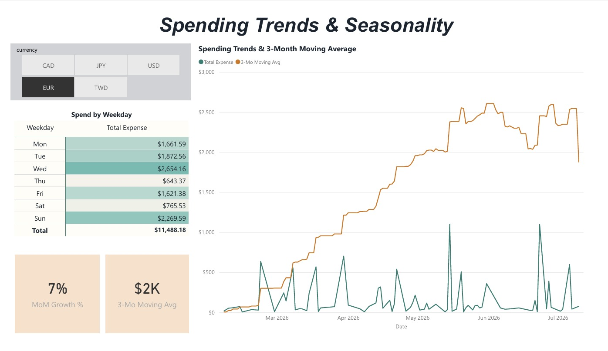
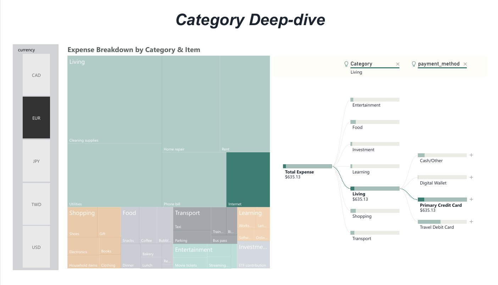

# Personal Finance Analytics — Power BI Dashboard

An interactive, multi-page Power BI report analyzing personal spending across
multiple currencies, payment methods, and time. Built on a real end-to-end data
pipeline: expenses are captured through a LINE chatbot, parsed by an LLM, stored
in a cloud MySQL-compatible database (TiDB), and modeled here in Power BI.

> **Note on data:** This repository ships with **synthetic sample data** that
> mirrors the exact schema of the production system. No real personal financial
> records are included. See [`data/`](data/) and
> [`generate_sample_data.py`](generate_sample_data.py).

---

## 📸 Dashboard Preview

### Overview
KPI cards, daily spend vs. cumulative trend, category split, and top transactions.



### Spending Trends & Seasonality
Month-over-month growth, a 3-month moving average, and a weekday spending heatmap.



### Category Deep-dive
A two-level treemap (category → item) alongside an AI decomposition tree.



> 📄 Prefer not to install Power BI? The full report is also exported as
> [`PersonalFinanceAnalytics_Demo.pdf`](PersonalFinanceAnalytics_Demo.pdf).

---

## ✨ Key Features

- **Multi-currency budgeting** — every KPI, chart, and table responds to a
  currency slicer (EUR / CAD / TWD / USD / JPY), each with its own budget target.
- **Time-intelligence analysis** — month-over-month growth, a 3-month moving
  average, and a cumulative running-total trend, all built on a dedicated
  Date dimension.
- **Behavioral heatmap** — a conditionally-formatted weekday matrix surfaces
  *when* spending happens, not just how much.
- **AI-assisted exploration** — a Decomposition Tree lets a reviewer click into
  "what's driving total spend" and auto-expand the highest-value path
  (category → payment method → date).
- **Budget vs. actual** — burn-rate percentage against a per-currency monthly
  budget, mirroring the logic of the companion Streamlit app.

---

## 🏗️ Data Model

A star-schema-style model with a central fact table and supporting dimensions:

```
                 ┌────────────────┐
                 │   DateTable    │  (dedicated date dimension,
                 │  (Mark as Date)│   dynamically bound to data range)
                 └───────┬────────┘
                         │ 1
                         │ *
┌──────────────┐   ┌─────┴──────────┐   ┌──────────────┐
│budget_settings│* 1│ daily_expenses │1 *│  user_cards  │
│ (per currency)├───┤   (fact table) ├───┤ (payment /   │
└──────────────┘   └────────────────┘   │  card dims)  │
                                          └──────────────┘
      fixed_expenses  (standalone — recurring bills reference)
```

| Table | Grain | Role |
|-------|-------|------|
| `daily_expenses` | one row per transaction | Fact table |
| `DateTable` | one row per calendar day | Date dimension (marked as date table) |
| `budget_settings` | one row per currency | Budget dimension |
| `user_cards` | one row per payment method | Payment/card dimension |
| `fixed_expenses` | one row per recurring bill | Reference (standalone) |

---

## 🧮 DAX Highlights

A few measures that show the analytical patterns behind the visuals:

**Running total (cumulative trend line):**
```dax
Running Total =
CALCULATE(
    [Total Expense],
    FILTER(ALLSELECTED(DateTable), DateTable[Date] <= MAX(DateTable[Date]))
)
```

**Month-over-month growth (time intelligence):**
```dax
Previous Month Expense = CALCULATE([Total Expense], DATEADD(DateTable[Date], -1, MONTH))
MoM Growth % = DIVIDE([Total Expense] - [Previous Month Expense], [Previous Month Expense])
```

**Filter-context-safe expense total** — uses `KEEPFILTERS` so category-level
visuals (e.g. the donut) intersect rather than overwrite the exclusion filter,
preventing an "Income" slice from silently showing expense totals:
```dax
Total Expense =
CALCULATE(
    SUM(daily_expenses[amount_original]),
    KEEPFILTERS(daily_expenses[Category] <> "Income"),
    KEEPFILTERS(daily_expenses[Category] <> "Transfer")
)
```

**Cross-filter override** — forces the budget table to respect a slicer built on
the fact-table side of a single-direction relationship:
```dax
Budget Amount =
CALCULATE(
    SUM(budget_settings[budget_amount]),
    CROSSFILTER(daily_expenses[currency], budget_settings[currency], BOTH)
)
```

---

## 🧹 Data Preparation (Power Query)

The source data is entered through a chatbot by two different paths (LLM parsing
and manual edits), which produced **inconsistent category labels** — some rows
tagged in Chinese (`飲食`), some in English (`Food`), and some combined
(`生活 Living`). A custom column normalizes all variants to a single canonical
label before the data reaches the model:

```m
if Text.Contains([category], "飲食") or Text.Contains([category], "Food") then "Food"
else if Text.Contains([category], "生活") or Text.Contains([category], "Living") then "Living"
... (etc.)
else [category]
```

---

## 🔍 Problems Solved (analyst's notes)

Documenting the non-obvious issues found and fixed while building this, since
diagnosing them is most of the actual work:

1. **Budget % understated across all currencies.** The `currency` slicer sits on
   the fact table (the "many" side), so selecting EUR didn't propagate to the
   budget dimension — `Budget Amount` was silently summing all currencies'
   budgets together. Fixed with a targeted `CROSSFILTER(..., BOTH)`.
2. **Phantom "Income" slice on an expense donut.** `CALCULATE`'s default
   same-column filter *replaces* existing filter context; wrapping the exclusion
   in `KEEPFILTERS` makes it *intersect* instead, so the slice correctly
   evaluates to blank.
3. **`DATEADD` broke under a bidirectional relationship.** Making the Date
   relationship two-way (to constrain a chart axis) violated `DATEADD`'s
   contiguous-selection requirement. Solved more cleanly by binding the
   `DateTable` range dynamically to `MIN/MAX(transaction_date)` and reverting the
   relationship to single-direction.
4. **Report running on stale cached data.** A broken Power Query step (missing
   header promotion) left the model silently serving an old snapshot. Confirmed
   via Data view's distinct-value count, then repaired the query chain.

---

## 🛠️ Tech Stack

- **Power BI Desktop** — modeling, DAX, report design
- **Power Query (M)** — ETL and category normalization
- **TiDB Cloud** (MySQL-compatible) — source database *(production)*
- **Custom JSON theme** — a "Finance Ledger" palette applied report-wide
  ([`theme/`](theme/))

**Companion projects:** the data pipeline that feeds this dashboard —
[AI Expense Dashboard (Streamlit)](https://github.com/fuwei-tsai/ai-expense-dashboard)
· [LINE Expense Bot](https://github.com/fuwei-tsai/line-expense-bot)

---

## 🚀 Run it yourself

1. Clone this repo.
2. Open `PersonalFinanceAnalytics_Demo.pbix` in Power BI Desktop.
3. If prompted for a data source, point the four queries at the CSVs in
   [`data/`](data/) (or run [`generate_sample_data.py`](generate_sample_data.py)
   to regenerate them).
4. Explore — use the currency and month slicers to filter every page.
